# graph.js

> ⚠️ **Disclaimer — AI-generated code.** This entire library, demos,
> benchmarks, and README were produced by [Claude](https://claude.ai/)
> in a chat session with a human reviewer. The code has been exercised
> by a Playwright test suite on Chromium and WebKit, but it has not been
> audited line-by-line by a human, it has no production users, and the
> API may change. **Treat it as a starting point, not a finished product.**
> Read it, run the demos, copy what you need — don't drop it into
> production without your own review.

A general-purpose, dependency-free interactive graph component for static
HTML pages. Built around a `<canvas>` for edges and DOM elements for
nodes, with a small public API designed for embedding into any page.

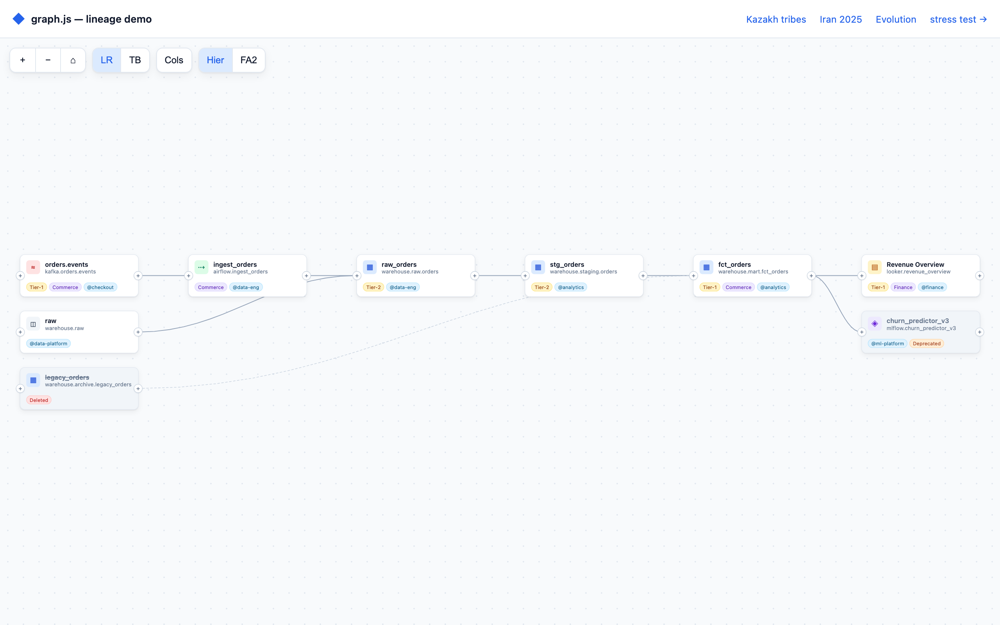

*Screenshot: the lineage demo (`demo/index.html`) — a real-world use case
built on top of `graph.js` with a custom `renderNode` and `edgeStyle`.*

---

## Table of contents

- [What you get](#what-you-get)
- [Quick start](#quick-start)
- [Demos](#demos)
- [Public API](#public-api)
- [Customization recipes](#customization-recipes)
- [Performance characteristics](#performance-characteristics)
- [Browser support](#browser-support)
- [Project layout](#project-layout)
- [Running the tests](#running-the-tests)
- [Known limitations](#known-limitations)
- [License](#license)

---

## What you get

- **Two files**: `lib/graph.js` and `lib/graph.css`. No build step. No
  npm install. Drop them in next to your HTML and you have a graph.
- **Vanilla JS** — no React, no Vue, no Svelte. Plain UMD module that
  exports a `Graph` global (also works with CommonJS / AMD).
- **Canvas-rendered edges** for performance: even 3000 edges pan at
  60 fps because edges are drawn into a single `<canvas>` element
  rather than 3000 SVG paths in the DOM.
- **DOM-rendered nodes** so each card is a normal HTML element you can
  style with CSS, attach handlers to, and inspect with DevTools.
- **Auto layout** (hierarchical, LR or TB) out of the box, with hooks
  to swap in your own layout engine or static positions.
- **Built-in toolbar**, **expand buttons**, **minimap-style FPS readout**,
  **drag**, **pan**, **zoom**, **fit-view**, **selection**, **edge hover
  hit-testing**, and **destroy()** for clean teardown.
- **Customization hooks**: `renderNode`, `edgeStyle`, `addToolbarButton`,
  custom layout function, per-node `position`/`width`/`height`/`className`.

It is **not**:

- A force-directed layout. The built-in layout is hierarchical longest-
  path ranking. Bring your own algorithm via the `layout` option if you
  need something else.
- A full diagramming tool. There's no orthogonal routing, no port-based
  connections, no rich text inside nodes (use your own HTML).
- Production-tested. See the disclaimer at the top.

---

## Quick start

```html
<!doctype html>
<html>
  <head>
    <link rel="stylesheet" href="graph.css" />
  </head>
  <body>
    <div id="g" style="width: 100%; height: 600px;"></div>

    <script src="graph.js"></script>
    <script>
      new Graph(document.getElementById("g"), {
        nodes: [
          { id: "a", label: "Alpha" },
          { id: "b", label: "Beta"  },
          { id: "c", label: "Gamma" },
        ],
        edges: [
          { id: "e1", source: "a", target: "b" },
          { id: "e2", source: "b", target: "c" },
        ],
      });
    </script>
  </body>
</html>
```

That's the whole hello-world. You get auto-layout, pan, zoom, drag,
node selection, the toolbar, and the FPS-friendly canvas edge renderer.

---

## Demos

The repository ships with two runnable demos in [`demo/`](demo). Either
open the HTML files directly in your browser, or serve the folder:

```bash
cd demo
python3 -m http.server 8000
# open http://localhost:8000/
```

### 1. Lineage explorer — `demo/index.html`

A realistic use case modeled on data-lineage UIs (à la OpenMetadata).
Shows how to compose the library into something domain-specific.


The lineage card design, entity icons, tier/domain/owner badges, and
deleted/deprecated states are entirely user-space — the library knows
nothing about them. They're produced by a `renderNode` callback in
[`demo/app.js`](demo/app.js):

```js
function renderLineageNode(node, el) {
  el.classList.add("lineage-card", "lineage-card--" + node.entity);
  el.innerHTML =
    '<div class="lineage-card__row">' +
      '<div class="lineage-card__icon">' + ENTITY_GLYPH[node.entity] + '</div>' +
      '<div class="lineage-card__title">' + node.name + '</div>' +
      // ...
    '</div>';
}

new Graph(container, { renderNode: renderLineageNode, /* ... */ });
```

#### Selection highlights neighbors

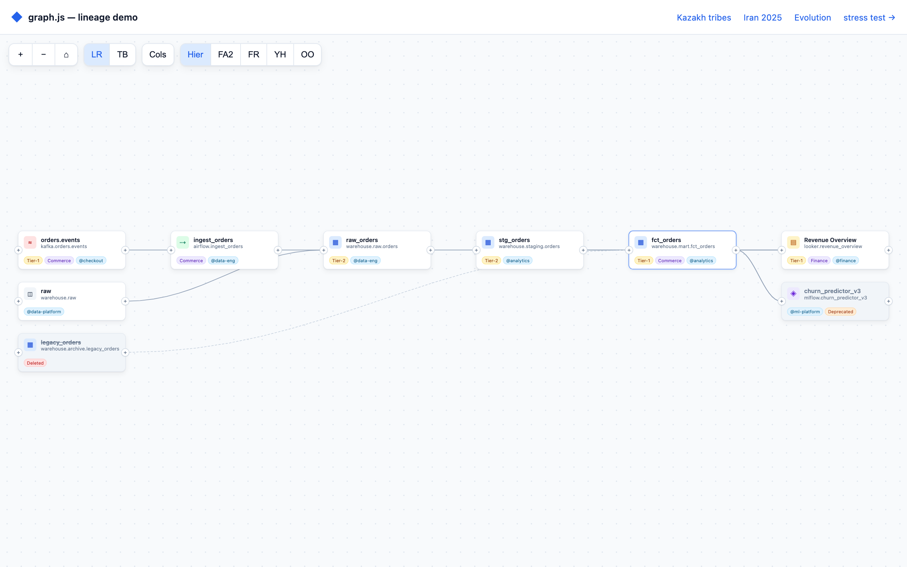

When a node is selected, incident edges are stroked in the accent color
automatically — no extra code from the consumer. The dimming of other
nodes and the blue ring on the selected card come from CSS classes the
library applies (`is-selected`, `is-dimmed`, `is-highlighted`).

#### Top-to-bottom layout

Click the **TB** button or call `graph.setDirection("TB")`:

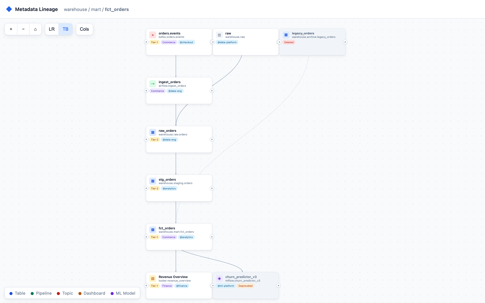

#### Column-lineage toggle (custom toolbar button)

The "Cols" button is **not** a library feature — it's added at runtime
by the consumer with `addToolbarButton`:

```js
graph.addToolbarButton({
  id: "cols", label: "Cols", title: "Toggle column lineage",
  onClick: (g) => { showColumns = !showColumns; g.setEdges(visibleEdges()); },
  pressed: () => showColumns,
}, { newGroup: true });
```

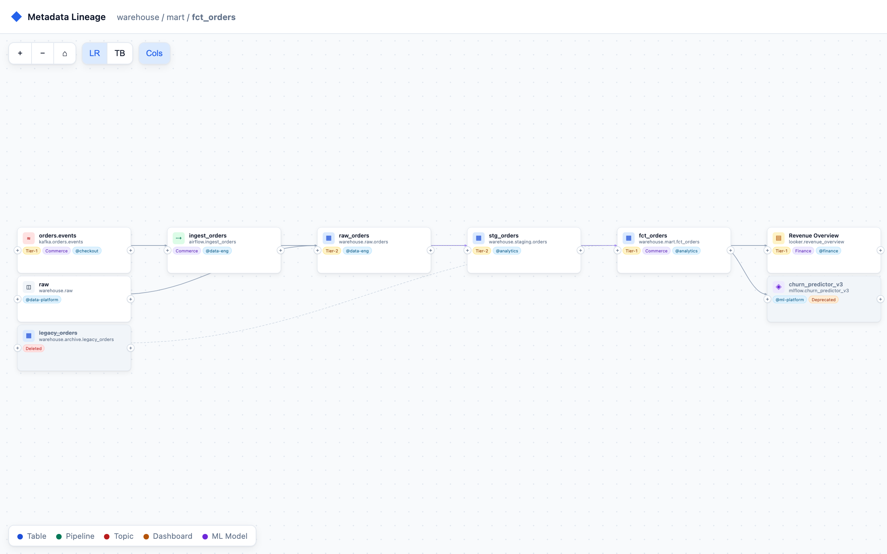

#### Drag

Pointer-event-based dragging works on touch, trackpad, and mouse. The
dragged card and its incident edges follow the cursor; everything else
stays put (and is composited via a cached bitmap snapshot — see the
[performance section](#performance-characteristics)).

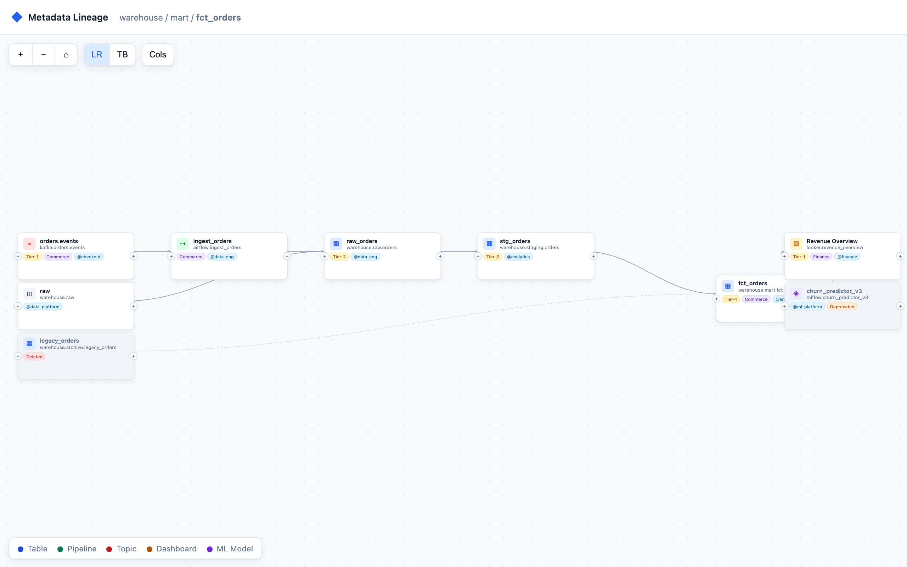

#### Expand callbacks

The `+` buttons on the side of each card are opt-in via the `expandable`
option. When clicked, they fire `onExpand(node, "up" | "down")` and the
consumer decides what to do — typically fetch more nodes from a server
and add them with `graph.addNode` / `graph.addEdge`.

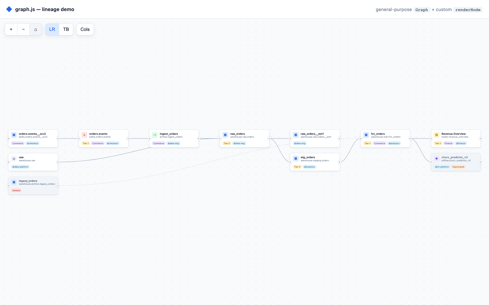

### 2. Kazakh tribes — `demo/tribes.html`

A **genetic-kinship network** of 11 Kazakh tribes — tribes connected
to each other based on the paternal haplogroups they share, rather
than a bipartite tribes-↔-haplogroups view. Data is from the
Wikipedia article
[*Y-DNA haplogroups in Kazakh tribes*](https://en.wikipedia.org/wiki/Y-DNA_haplogroups_in_Kazakh_tribes).

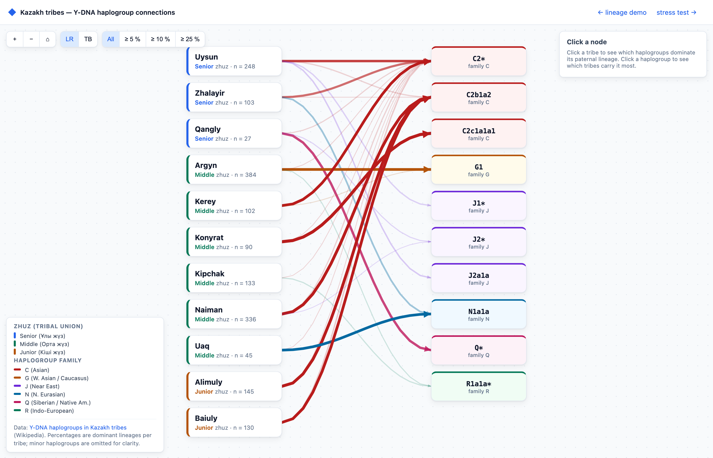

**How edges are computed.** For each pair of tribes (A, B):

```
similarity(A, B) = Σ_h  min( A.pct[h], B.pct[h] )
```

over all Y-DNA haplogroups `h`. That sum is the joint frequency of
paternal lineages the two tribes share. The edge color is the
**dominant shared haplogroup** — the one contributing the largest
`min(…)` to the total — using the same palette family as the
[Evolution demo](#4-map-of-evolution--demoevolutionhtml). Edge width
scales with `√similarity`.

**Layout.** Three columns by zhuz (tribal union): Senior on the left,
Middle in the middle, Junior on the right. Tribes carry a colored
left-border accent showing their zhuz (cyan / emerald / amber). The
columnar layout makes the central question of the graph visually
obvious: *do shared haplogroups respect zhuz boundaries, or cut
across them?*

#### The story the graph tells

- The **thickest gold edge** is the **Alimuly ↔ Baiuly** C-M48
  (C2b1a2) link: 77 % of Alimuly males and 69 % of Baiuly males carry
  this lineage — the founder bond of the Junior zhuz, often associated
  with descent from Emir Alau. Edge weight is `min(77, 69) = 69`.
- **Naiman** (Middle zhuz) carries C-M48 at a *moderate* 27 % and is
  attached to both Junior tribes by thinner gold edges at weight 27.
  Less dramatic than the Junior pair, but still a meaningful
  cross-zhuz genetic link.
- **Red C2\* edges** (broad Eurasian Steppe) form the background
  network: Uysun (50 %), Zhalayir (38 %), Kerey (66 %), Naiman (10 %),
  and Baiuly (13 %) all carry it at ≥10 %, so they're mutually
  connected.
- A **blue N1a1a edge** at weight 22 between **Zhalayir** (Senior,
  22 %) and **Uaq** (Middle, 64 %) reflects shared Uralic / Siberian
  ancestry — a cross-zhuz bond mirroring the C-M48 pattern.
- Below the default threshold (at ≥5 %), more sub-networks appear:
  a **J2 chain** (Kipchak 22 % — Uysun 8 % — Qangly 7 %) and an
  **R1a1a network** spanning Zhalayir, Argyn, Kerey, and Kipchak at
  6–8 %.
- **Argyn**, despite being one of the largest Middle-zhuz tribes,
  is almost an isolate at high thresholds: its founder lineage is G1
  (67 %) which barely shows up elsewhere. At ≥5 % it gains
  connections via C-M48 (5 %), R1a1a (6 %), and G1 (7 % shared with
  Qangly).
- **Konyrat** is essentially genetically alone: 86 % of its men carry
  C-M407 (C2c1a1a1), a lineage no other tribe carries at meaningful
  frequency. No edges at any threshold > 4 %.

Clicking **Naiman** opens its full breakdown — paternal haplogroups
first, then genetic neighbors sorted by shared dominance:

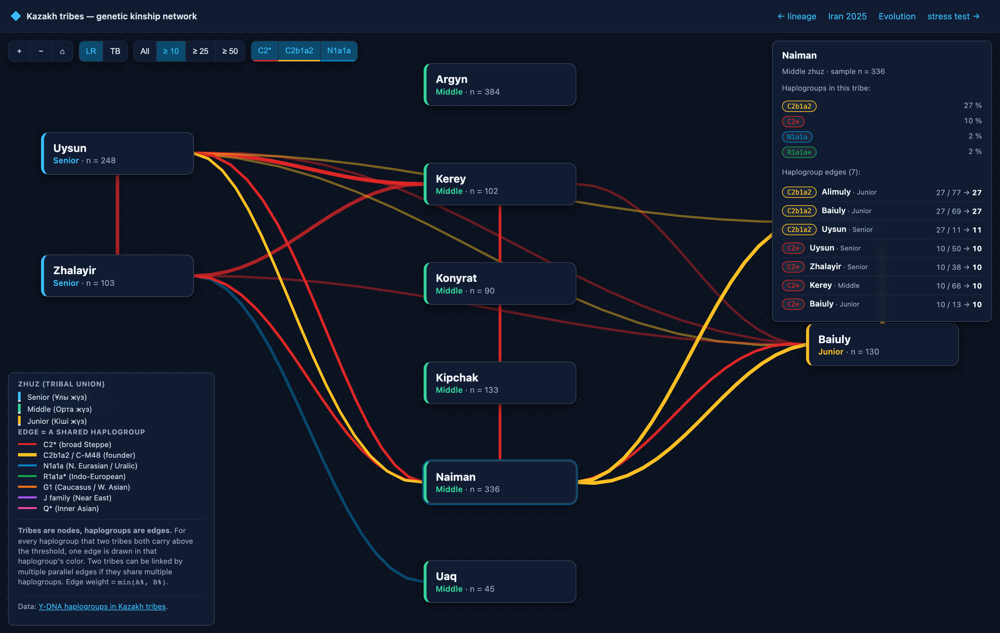

The toolbar's threshold filters (`All / ≥ 10 / ≥ 25 / ≥ 50`) let you
peel away weaker connections. At **≥ 50** only founder-level links
remain, and the cross-zhuz C2-M48 triangle (Naiman ↔ Alimuly ↔ Baiuly)
stands almost alone alongside one C2* link between Uysun and Kerey:

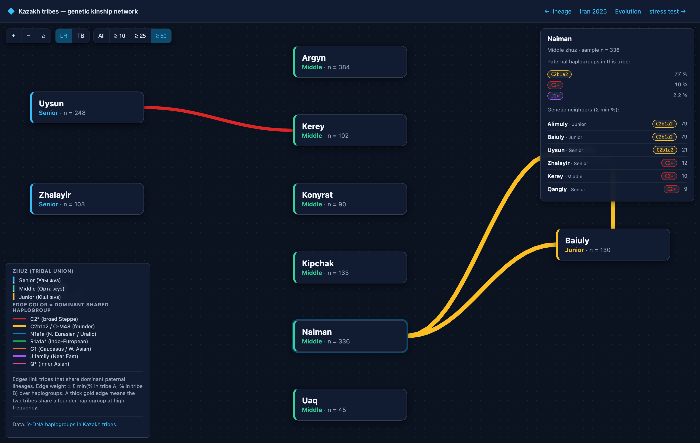

#### Library features exercised

- **Static-positioned, undirected graph.** The 11 tribes are placed
  at hand-tuned coordinates via `node.position`. Edges set
  `arrow: false` because "shared haplogroup" is a symmetric relation.
- **Same-column edge routing.** Three Senior tribes stack in one
  column; six Middle tribes stack in another; the two Junior tribes
  stack in the third. The library detects "vertical sibling" pairs
  (same column, different y) and routes the bezier along the
  connecting axis, instead of producing the horizontal-S that
  forward routing would give for stacked nodes. This was added to
  the library specifically for this demo; it also cleans up the
  Iran demo's same-column edges and helps any static-positioned
  graph.
- **Dark theme** via the `--gv-*` CSS variables on `.gv`.
- **Click-driven info panel** shows haplogroup composition + a
  sorted neighbor table for a tribe, or the per-haplogroup overlap
  breakdown for an edge.

> ⚠ Sample sizes vary by tribe (Qangly: n = 27, Argyn: n = 384). Only
> haplogroups carried at ≥ 2 % are in the dataset; minor lineages
> below that threshold are omitted. Percentages come from the primary
> table on the linked Wikipedia article, which is itself a summary of
> several primary studies — different subclades and different sampling
> can produce noticeably different numbers, so treat the values as
> illustrative rather than definitive.

### 3. Iran–Israel–US 2025 — `demo/iran-war.html`

A conflict-graph view of the June 2025 Israel–Iran–US escalation,
adapted from a user-supplied Graphviz outline of the actors,
strikes, proxy attacks, alliances, and ceasefire diplomacy.

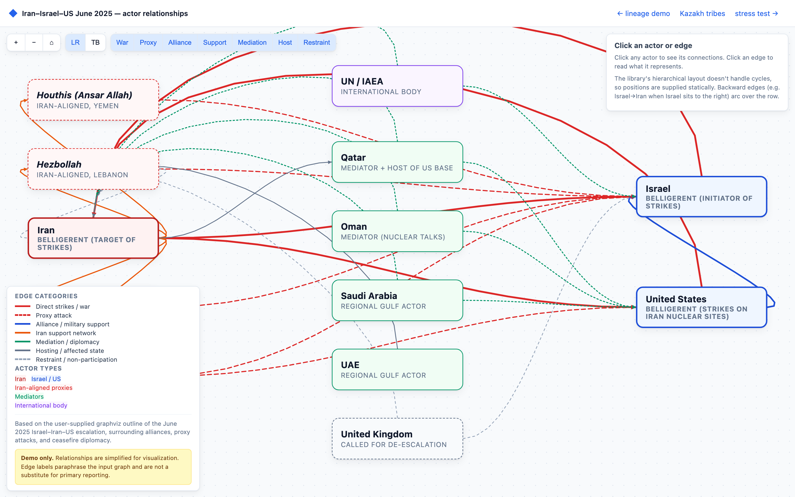

The demo uses static `node.position` overrides to lay out three
columns: Iran and its support network on the left, mediators and
international bodies in the middle, Israel and the United States on
the right. Edges are categorized — direct strikes, alliance, proxy
attacks, mediation, support network, hosting, restraint — and the
toolbar gates each category on or off.

Click any actor to see its full set of incoming and outgoing
relationships. Each entry is tagged with the matching category pill:

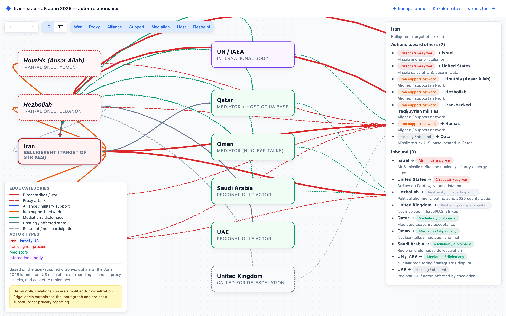

Toggling off the diplomatic and support categories leaves the
**kinetic** layer — direct strikes, alliance, and proxy attacks:

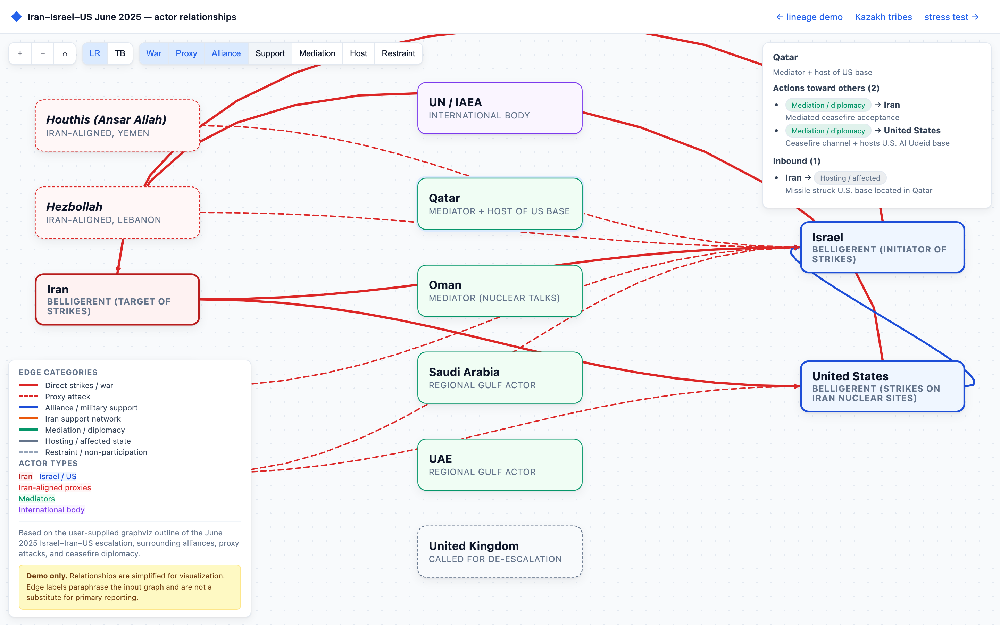

The interesting library feature exercised here is **backward-edge
routing**: a graph this cyclic (Israel ↔ Iran, US ↔ Iran) breaks
hierarchical layout, so the demo supplies static positions and lets
the library detect when a target sits behind its source in the flow
axis. The library then anchors that edge on the *top* of both nodes
and arcs the bezier above the row instead of routing it through
off-screen control points. You can see it in the `Israel → Iran`
strike edge — it curves over the top of the row while `Iran → Israel`
goes through the middle, keeping the bidirectional pair visually
distinct.

> ⚠️ The relationship labels in this demo paraphrase the user-supplied
> graph and are not a substitute for primary reporting. It's a
> visualization exercise, not analysis.

### 4. Map of Evolution — `demo/evolution.html`

A curated, interactive tree of life from LUCA to Homo sapiens — inspired
by Kurzgesagt's
[*Map of Evolution*](https://shop-eu.kurzgesagt.org/products/poster-map-of-evolution)
poster. 73 clades + 10 evolutionary milestone events, all in a single
LR-laid-out DAG.

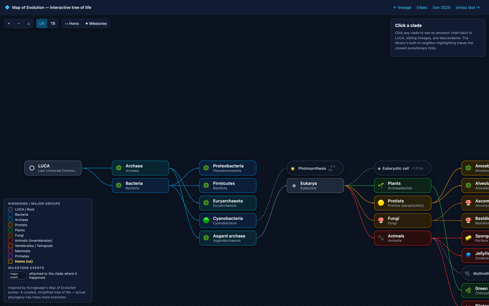

The structure that falls out for free: LUCA branches into the three
domains (Bacteria, Archaea, Eukarya), each domain branches further into
kingdoms, kingdoms into phyla, and so on down to species-level
distinctions for great apes. Edges are **colored by the descendant's
kingdom** so each lineage paints its own visual stream as the tree fans
out — bacteria stay blue, plants green, animals red, vertebrates
orange, mammals pink, primates purple, *Homo* gold.

**Evolutionary milestone events** are attached to the clade where they
happened (Photosynthesis → Cyanobacteria, Cambrian Explosion → Bilateria,
K–Pg extinction → Placentalia, …) and rendered as **dashed-edge pills**
visually distinct from the main tree:

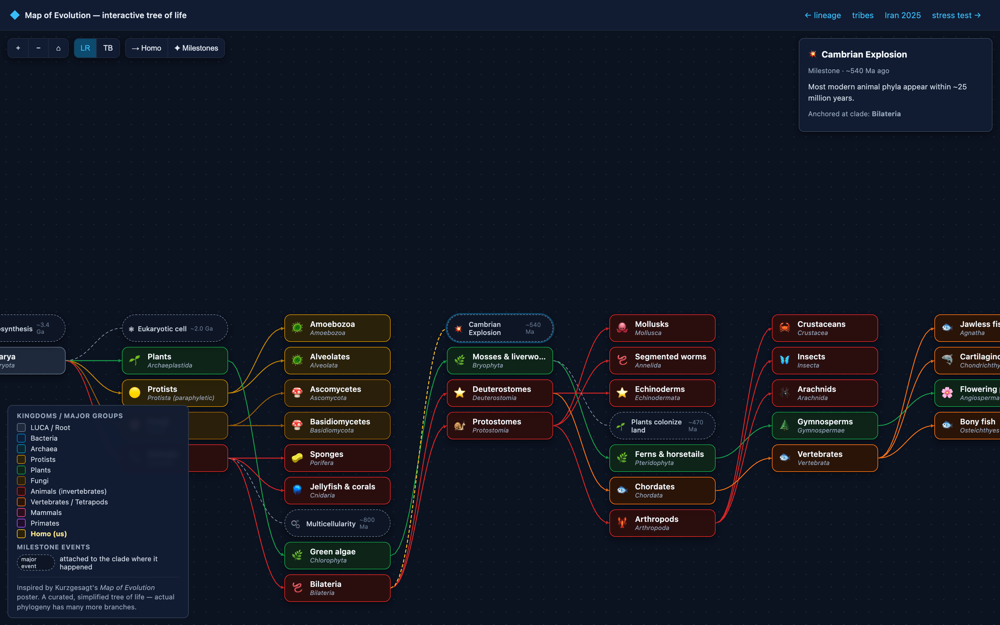

Toolbar adds two custom buttons:
- **→ Homo** — recenters the viewport on humans and selects the node, so
  the library's neighbor-highlighting lights up the immediate
  ancestor + sibling great-ape lineages.
- **✦ Milestones** — selects the first milestone (Photosynthesis) as a
  starting point for browsing the major events along the tree.

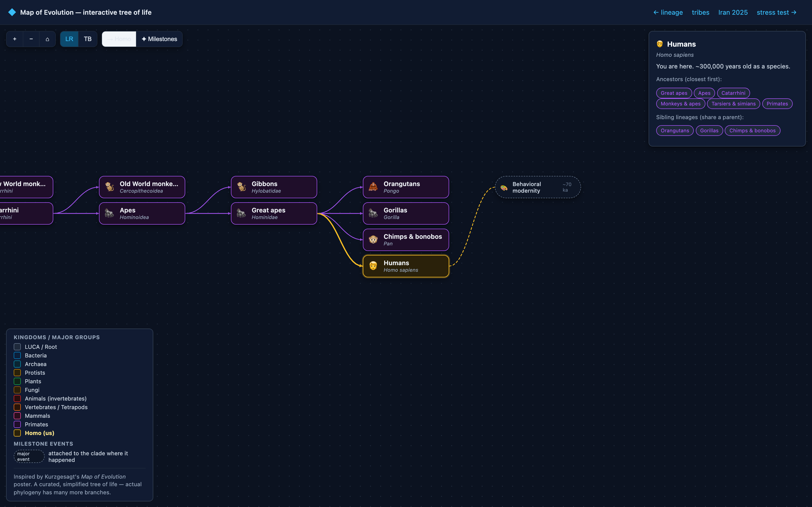

Clicking any clade in the info panel surfaces three useful relationships
the underlying tree already encodes:

- **Ancestors** (closest first) — the lineage walk back toward LUCA
- **Sibling lineages** — other branches that share the same parent
- **Descendant branches** — what diversified from this clade

For Homo this reads as: ancestors *Great apes → Apes → Catarrhini →
Simiiformes → Haplorhini → Primates …*; siblings *Pan, Gorilla, Pongo*;
descendants — just one, *Behavioral modernity*. Click *Pan* and you
get a different walk through the same tree.

The demo also uses a **dark theme**, set by overriding the `--gv-*` CSS
variables on `.gv` — the same library as the other demos, just retinted:

```css
.gv {
  --gv-bg:       #0b1220;
  --gv-grid:     #1e293b;
  --gv-surface:  #111c33;
  --gv-text:     #e2e8f0;
  --gv-accent:   #38bdf8;
  /* ... */
}
```

The tree is deep — the path from LUCA to *Homo sapiens* is 22 ranks —
so the default `fitView()` zooms out far. Use the **→ Homo** button,
or scroll-wheel zoom, to drill in.

### 5. Stress test — `demo/large.html`

The same library, now with **1000 nodes and 3000 edges** in a 10-layer
DAG, generated procedurally:

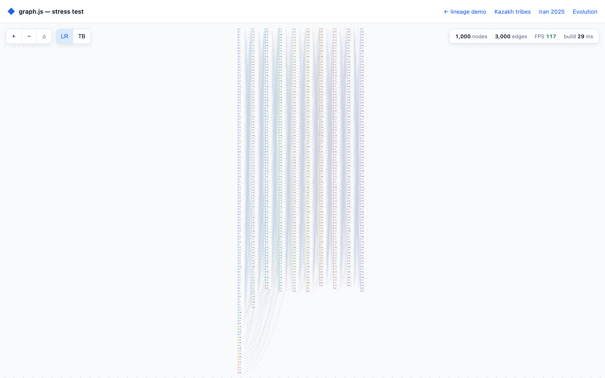

The colored vertical bars on the left of each card are layer indicators
(blue → purple). The FPS readout in the top-right corner stays at
vsync during pan, zoom, and drag. See `demo/large.js` for the procedural
generator (it uses a seeded PRNG so the graph is identical across
reloads).

Top-to-bottom view of the same graph:

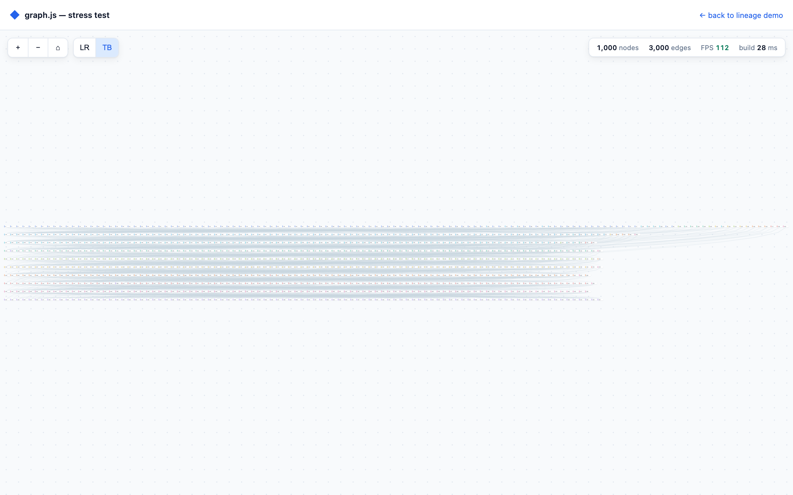

---

## Public API

### Constructor

```js
const graph = new Graph(container, options);
```

`container` is any HTML element. The library will populate it with the
graph canvas, node DOM, and toolbar. CSS sets `position: relative` on
the container so make sure it has a size (`width`, `height`).

`options` (all optional):

| Option | Type | Default | Description |
|---|---|---|---|
| `nodes` | `Array<Node>` | `[]` | Initial node data. See [Node shape](#node-shape). |
| `edges` | `Array<Edge>` | `[]` | Initial edges. See [Edge shape](#edge-shape). |
| `direction` | `"LR" \| "TB"` | `"LR"` | Initial layout axis. |
| `layout` | `"auto" \| Function` | `"auto"` | `"auto"` uses the built-in hierarchical layout. Pass a function to override — see [Custom layout](#custom-layout). |
| `nodeWidth` | `number` | `200` | Default card width in graph px. |
| `nodeHeight` | `number` | `60` | Default card height. |
| `rankSeparation` | `number` | `100` | Distance between layers. |
| `nodeSeparation` | `number` | `28` | Distance between nodes within a layer. |
| `renderNode` | `Function` | `null` | `(node, element, graph) => void`. Fill the outer `.gv-node` element however you like. If omitted, a default renderer shows `node.label`. |
| `edgeStyle` | `Function` | `null` | `(edge, state) => { stroke, width, dash?, arrow? }`. `state` is `"base" \| "neighbor" \| "hover" \| "selected"`. Return `null` from a state to use the default highlight behavior. |
| `showToolbar` | `boolean` | `true` | Show the floating toolbar. |
| `toolbarButtons` | `Array \| null` | `null` (defaults) | Replace the default toolbar entirely. See [Custom toolbar](#custom-toolbar). |
| `expandable` | `boolean \| object \| Function` | `false` | Show `+` buttons on each node. `true` = both sides, `{ up: true }` = only upstream, or `(node) => ({ up, down })` for per-node control. |
| `draggable` | `boolean` | `true` | Allow nodes to be dragged. |
| `selectable` | `boolean` | `true` | Single-click selects a node/edge. |
| `minZoom` | `number` | `0.2` | Zoom-out limit. |
| `maxZoom` | `number` | `2.5` | Zoom-in limit. |
| `fitPadding` | `number` | `40` | Padding (in graph px) used by `fitView()`. |
| `hitTolerancePx` | `number` | `6` | Edge hover/click pixel-tolerance (in screen pixels). |
| `onNodeClick` | `Function` | `null` | `(node, event) => void`. |
| `onEdgeClick` | `Function` | `null` | `(edge, event) => void`. |
| `onEdgeHover` | `Function` | `null` | `(edge \| null) => void`. Fires when the hovered edge changes; cheap to subscribe to. |
| `onExpand` | `Function` | `null` | `(node, direction) => void`. `direction` is `"up"` or `"down"`. |
| `onNodeDrag` | `Function` | `null` | `(node, { x, y }) => void`. Fires per animation frame during drag, not per pointer event. |
| `onNodeDragEnd` | `Function` | `null` | `(node, { x, y }) => void`. |
| `onPaneClick` | `Function` | `null` | `(event) => void`. Click on empty pane. |
| `onSelectionChange` | `Function` | `null` | `({ nodeId, edgeId }) => void`. |

### Node shape

```ts
interface Node {
  id: string;                  // required, must be unique
  label?: string;              // shown by default renderer
  className?: string;          // added to the .gv-node element
  position?: { x: number, y: number }; // override auto-layout for this node
  width?: number;              // override default node width
  height?: number;             // override default node height
  // …any other fields you put here are passed through to renderNode
  //   and to callbacks (onNodeClick, onExpand, etc.)
}
```

### Edge shape

```ts
interface Edge {
  id: string;                  // required, must be unique
  source: string;              // source node id
  target: string;              // target node id
  // …any other fields you put here are passed through to edgeStyle
  //   and to callbacks (onEdgeClick, onEdgeHover)
}
```

### Instance methods

| Method | Returns | Description |
|---|---|---|
| `setNodes(nodes)` | `void` | Replace the node array. |
| `setEdges(edges)` | `void` | Replace the edge array. |
| `setData(nodes, edges)` | `void` | Replace both atomically. |
| `addNode(node)` | `void` | Append one node and rerender. |
| `addEdge(edge)` | `void` | Append one edge and rerender. |
| `removeNode(id)` | `void` | Remove a node and all its incident edges. |
| `removeEdge(id)` | `void` | Remove one edge by id. |
| `updateNode(id, patch)` | `void` | Shallow-merge `patch` into the node; re-runs `renderNode` for that one card. |
| `setDirection("LR"\|"TB")` | `void` | Re-layout with a new axis. |
| `getDirection()` | `"LR"\|"TB"` | Current layout axis. |
| `selectNode(id \| null)` | `void` | Programmatic selection; fires `onSelectionChange`. |
| `selectEdge(id \| null)` | `void` | Same for edges. |
| `getSelection()` | `{nodeId, edgeId}` | Current selection. |
| `zoomIn()` / `zoomOut()` | `void` | Step zoom by 1.2×. |
| `fitView()` | `void` | Fit all nodes in the viewport with `fitPadding`. |
| `getViewport()` | `{x, y, zoom}` | Current pan/zoom. |
| `setViewport({x?, y?, zoom?})` | `void` | Set pan/zoom (partial OK). |
| `getNodePosition(id)` | `{x, y} \| null` | Current laid-out position for a node. |
| `addToolbarButton(spec, options?)` | `HTMLButtonElement` | Append a button to the toolbar after init. See [Custom toolbar](#custom-toolbar). |
| `destroy()` | `void` | Tear down all DOM and event listeners; the container is restored. |

---

## Customization recipes

### Custom `renderNode`

`renderNode` receives the outer `.gv-node` element — fill it however you
want. The library will append the `+` expand buttons after your code
runs, so don't worry about clobbering them with `innerHTML`.

```js
new Graph(container, {
  nodes: [{ id: "u1", name: "Alice", role: "admin", avatar: "/a.png" }],
  edges: [],
  renderNode: (node, el) => {
    el.classList.add("user-card");
    el.innerHTML = `
      
      <div class="user-card__name">${node.name}</div>
      <div class="user-card__role">${node.role}</div>
    `;
  },
});
```

Then style `.user-card` in your own CSS. The library only owns
`.gv-node`, `.gv-node__label`, `.gv-node__body`, and `.gv-node__expand`.

### Custom `edgeStyle`

Return a style object per edge. The library applies `"hover"`,
`"selected"`, and `"neighbor"` highlight states automatically; override
those states explicitly if you want a non-default look.

```js
new Graph(container, {
  edgeStyle: (edge, state) => {
    if (edge.kind === "deleted")
      return { stroke: "#cbd5e1", width: 1, dash: [4, 4], arrow: false };
    if (edge.kind === "async")
      return { stroke: "#a78bfa", width: 1.2, dash: [3, 3], arrow: true };
    // returning null/undefined falls back to the default base style
    //   (gray, width 1.5, arrow on)
    return null;
  },
});
```

The returned object can include:
- `stroke` (CSS color)
- `width` (px in graph coords)
- `dash` (array, e.g. `[4, 4]`)
- `arrow` (boolean)

### Custom toolbar

Either replace the toolbar wholesale via the `toolbarButtons` option, or
append to it at runtime with `addToolbarButton`.

```js
graph.addToolbarButton({
  id: "snap",
  label: "📸",
  title: "Export PNG",
  onClick: (g) => {
    const url = document.querySelector(".gv__canvas").toDataURL();
    const a = document.createElement("a");
    a.href = url; a.download = "graph.png"; a.click();
  },
  // Optional: pressed(g) -> boolean controls the .is-active visual state.
});
```

Button spec:

```ts
interface ToolbarButton {
  id?: string;        // becomes data-id on the <button>
  label: string;      // text content (or emoji / symbol)
  title?: string;     // tooltip
  onClick: (g) => void;
  pressed?: (g) => boolean;  // optional toggle state
  separator?: boolean;       // start a new visual group (no other fields)
}
```

### Switching layouts at runtime

Every demo's toolbar now ends with a **layout selector** — two buttons
that toggle between the demo's default and ForceAtlas2:

| Demo | Default button label | FA2 button | Notes |
|---|---|---|---|
| Lineage | `Hier` | `FA2` | Both layouts work cleanly on the small DAG |
| Tribes | `Zhuz` | `FA2` | FA2 drops the static zhuz columns so genetic clusters can emerge spatially — the C-M48 founder triangle (Naiman / Alimuly / Baiuly) becomes a *spatial* triangle |
| Iran 2025 | `Roles` | `FA2` | FA2 drops the role-based columns; Iran's proxies cluster around Iran, mediators sit on one side, Israel-US on the other |
| Evolution | `Hier` | `FA2` | FA2 turns the 22-rank LR tree into a radial fan-out from LUCA |
| Stress | `Hier` | `FA2` | FA2 with 1000 nodes is O(N²) — uses 60 iterations and takes a few seconds; works but slow |

Programmatically the library exposes:

```js
graph.setLayout("forceatlas2");                  // string name
graph.setLayout({ name: "forceatlas2",
                  iterations: 300, seed: 7 });   // object with options
graph.setLayout(myCustomLayoutFn);                // function
graph.getLayoutName();                            // "auto" | "forceatlas2" | "custom" | ...
```

The static-positioned demos (tribes, Iran) maintain two versions of
their node array — one with `node.position` set, one with it stripped —
and swap which one is fed to `setNodes()` when the selector toggles, so
that switching to FA2 lets the algorithm place nodes freely instead of
honoring the hand-tuned columns.

### Built-in layouts

Two layout algorithms ship with the library:

| Name | Aliases | What it does |
|---|---|---|
| `"hierarchical"` | `"auto"` (default) | Longest-path rank + barycenter ordering. Good for DAGs (lineage, evolution trees). |
| `"forceatlas2"` | `"fa2"` | ForceAtlas2 (Jacomy et al., PLoS ONE 2014). Force-directed, naturally produces clusters. Good for similarity / kinship / network graphs without a clear top-down structure. |

Select either by name:

```js
new Graph(container, { layout: "forceatlas2" });
```

Or with per-algorithm options:

```js
new Graph(container, {
  layout: { name: "forceatlas2",
            iterations: 200,
            gravity: 1,
            scalingRatio: 10,
            preventOverlap: true,
            jitterTolerance: 1,
            seed: 42,           // deterministic initial placement
          },
});

// equivalent form using layoutOptions:
new Graph(container, {
  layout: "forceatlas2",
  layoutOptions: { iterations: 200, gravity: 1, seed: 42 },
});
```

ForceAtlas2 options:

- **`iterations`** (default `200`) — how long to run. More = more converged.
- **`scalingRatio`** (default `10`) — strength of node repulsion. Larger values spread the graph out more.
- **`gravity`** (default `1`) — pulls nodes toward the origin. Keeps disconnected components from drifting apart.
- **`preventOverlap`** (default `true`) — short-range repulsion that keeps node boxes from interpenetrating.
- **`jitterTolerance`** (default `1`) — adaptive-speed tuning. Larger = faster convergence but more wobble.
- **`slowDown`** (default `1`) — divides per-frame displacement. Crank it up if the layout oscillates instead of settling.
- **`seed`** (default `1`) — initial-placement RNG seed. **The same seed always produces the same layout** for the same graph, which is what the test suite relies on.
- **`nodeWidth`** / **`nodeHeight`** — used for `preventOverlap`; defaults to the constructor's `nodeWidth` / `nodeHeight`.

You can also call a layout directly without a `Graph` instance — useful for precomputing positions in a worker or generating screenshot fixtures:

```js
const result = Graph.layouts.forceatlas2(nodes, edges, {
  iterations: 200, seed: 42, nodeWidth: 200, nodeHeight: 60,
});
// → { positions: { id: {x, y, w, h}, ... }, width, height }
```

### Custom layout

If neither built-in fits, pass your own function:

```js
new Graph(container, {
  layout: (nodes, edges, opts) => {
    // opts: { direction, nodeWidth, nodeHeight, rankSeparation, nodeSeparation }
    const positions = {};
    for (const n of nodes) {
      positions[n.id] = { x: ..., y: ..., w: opts.nodeWidth, h: opts.nodeHeight };
    }
    return { positions, width: ..., height: ... };
  },
});
```

Or skip layout entirely by giving each node a `position`:

```js
new Graph(container, {
  nodes: [
    { id: "a", label: "A", position: { x: 100, y: 100 } },
    { id: "b", label: "B", position: { x: 300, y: 200 } },
  ],
  edges: [{ id: "e", source: "a", target: "b" }],
});
```

Static positions still go through the auto-layout pipeline, but
`position` overrides the result per node.

### Async/remote expansion

```js
new Graph(container, {
  expandable: true,
  onExpand: async (node, direction) => {
    const more = await fetch(`/api/lineage/${node.id}?dir=${direction}`).then(r => r.json());
    for (const n of more.nodes) graph.addNode(n);
    for (const e of more.edges) graph.addEdge(e);
  },
});
```

### Theming with CSS variables

All colors are exposed as CSS variables on `.gv`. Override on any
ancestor:

```css
.gv {
  --gv-bg: #0f172a;
  --gv-grid: #1e293b;
  --gv-surface: #1e293b;
  --gv-border: #334155;
  --gv-text: #e2e8f0;
  --gv-muted: #94a3b8;
  --gv-accent: #38bdf8;
  --gv-accent-soft: #075985;
  --gv-shadow: 0 1px 2px rgba(0, 0, 0, 0.4), 0 4px 12px rgba(0, 0, 0, 0.3);
}
```

---

## Performance characteristics

This was a deliberate optimization target. The library is designed to
stay at 60 fps on graphs in the **low thousands of edges**.

### Architecture in one paragraph

Nodes are DOM elements (so you can put real HTML in them). Edges are
drawn into a `<canvas>` element behind the node layer — *not* as
individual SVG paths in the DOM. Hover/click on edges is implemented
by hit-testing pointer events against cached edge geometry, since
canvas pixels don't dispatch events.

### Optimizations layered in

1. **Canvas rendering of edges** instead of SVG/DOM. A single
   `ctx.stroke()` paints all edges with the same style.
2. **Batched paths by style** — edges with the same stroke color, width
   and dash are accumulated into a single `Path2D` and stroked once.
3. **`Path2D` cache** invalidated only on geometry change. Pan and zoom
   don't rebuild paths at all — they just stroke the cached `Path2D`
   with a new viewport transform.
4. **Static/dynamic split during drag** — at the start of a drag the
   ~6 edges incident to the dragged node are pulled out into a separate
   "dynamic" `Path2D`. The static `Path2D` (the other ~2994 edges) is
   built once and never re-built during drag.
5. **Bitmap snapshot of the static layer** — for engines that
   re-tessellate on every `ctx.stroke(Path2D)` (notably WebKit), we
   render the static layer once into an `OffscreenCanvas`, transfer it
   to an `ImageBitmap`, and `drawImage()` that bitmap every drag frame.
   That's a single GPU texture sample, not a path stroke.
6. **rAF-coalesced `pointermove`** — trackpads fire `pointermove` at
   100+ Hz. The handler just stashes the latest position; the actual
   work (position update, edge geometry rebuild) runs at vsync rate.
7. **`transform: translate(…)` + `will-change: transform`** on the
   dragged card — composited move, no layer repaint.
8. **DOM node diffing** — `_renderNodes` keeps a map of `id -> element`
   and reuses existing cards across relayouts. A direction toggle (LR ↔
   TB) on 1000 nodes is ~8 ms because it only updates `left/top` on
   existing elements instead of recreating them.
9. **16-sample bezier** instead of 24 — visually indistinguishable at
   any zoom but 33 % less stroke geometry.

### Measured numbers (1000 nodes, 3000 edges, headless)

```
engine      metric                  optimized      naive    speedup
-------------------------------------------------------------------
chromium    pan/zoom (one frame)     0.004 ms    1.328 ms    332x
chromium    drag step (one frame)    0.018 ms    1.070 ms     59x
chromium    drag end-to-end (20 mv)  35.1 ms     —          569 fps
webkit      pan/zoom (one frame)     1.760 ms    2.780 ms    1.6x
webkit      drag step (one frame)    0.020 ms    2.860 ms   143x
webkit      drag end-to-end (20 mv)  136.4 ms    —          147 fps
```

Run the bench yourself: `python3 demo/bench.py`.

The "drag end-to-end" measurement includes the full pipeline —
synthesized `pointerdown` + 20 `pointermove`s + `pointerup`, with a
double `requestAnimationFrame` flush before stopping the clock. It's
the closest synthetic approximation of a real human drag.

---

## Browser support

Tested in headless **Chromium** and headless **WebKit** via Playwright
(see [Running the tests](#running-the-tests)).

Used features:

- `PointerEvent` + `setPointerCapture` — Safari 13+, Chrome 55+, Firefox 59+.
- `ResizeObserver` — Safari 13.1+, Chrome 64+, Firefox 69+.
- `Path2D` — all modern browsers.
- `OffscreenCanvas` (with synchronous fallback to a hidden `<canvas>`) —
  Safari 16.4+, Chrome 69+, Firefox 105+.
- `transferToImageBitmap` (used opportunistically; falls back if absent).
- CSS `will-change` — all modern browsers.

No IE support. No transpilation. If you need to support older browsers,
run the file through Babel or transpile your own copy.

---

## Project layout

```
lib/                  Canonical library source.
  graph.js              Single-file UMD library (~1000 lines).
  graph.css             Scoped styles under .gv.
demo/                 Runnable demos. Library files are copied here
                      so the demo is self-contained (no `../lib/` path).
  index.html            Lineage explorer demo.
  app.js                Mock data + customization callbacks.
  styles.css            Page chrome + lineage-card theming.
  tribes.html           Bipartite demo: Kazakh tribes ↔ Y-DNA haplogroups.
  tribes.js             Data + bipartite renderNode/edgeStyle.
  iran-war.html         Conflict-graph demo: June 2025 Israel-Iran-US.
  iran-war.js           Static-positioned cyclic graph + category filters.
  evolution.html        Tree of life demo (dark theme).
  evolution.js          Curated tree-of-life data + milestone events.
  large.html            1000-node stress demo.
  large.js              Procedural graph generator.
  graph.js, graph.css   Copies of lib/. Refresh with `cp lib/graph.* demo/`.
  assess.py             Playwright assessment / regression tests.
  bench.py              Microbenchmark vs naive implementation.
README.md             You are here.
```

The legacy [`src/lineage/`](src/lineage) folder contains a React +
React Flow version of an earlier prototype (different code path, not
used by the vanilla library — kept for reference).

---

## Running the tests

The Playwright suite verifies functional correctness on both Chromium
and WebKit and produces screenshot artifacts.

```bash
pip3 install playwright
python3 -m playwright install chromium webkit

# Full suite (lineage + stress, both engines):
python3 demo/assess.py

# Just one engine:
python3 demo/assess.py chromium
python3 demo/assess.py webkit

# Just the 1000-node stress tests:
python3 demo/assess.py --stress-only

# Microbenchmark (optimized vs naive):
python3 demo/bench.py
```

Screenshots end up in `demo/screenshots/<engine>/`.

A passing run looks like:

```
=========================  CHROMIUM  =========================
30/30 checks passed
=========================  CHROMIUM — STRESS  =========================
14/14 checks passed
=========================  WEBKIT  =========================
30/30 checks passed
=========================  WEBKIT — STRESS  =========================
14/14 checks passed
```

The tests exercise: library surface (no lineage-specific identifiers
leak from the library), default rendering, all customization hooks,
selection, drag (real mouse events through Playwright), expand
callbacks, pan, zoom, fit-view, direction toggle, column-lineage
toggle, `destroy()` cleanup, and per-node `position` overrides.

---

## Known limitations

- **Layout** is hierarchical longest-path only. No force-directed, no
  orthogonal routing, no compound nodes. Bring your own via `layout`.
- **Edge routing** is a cubic bezier between source/target anchors.
  Edges can overlap nodes if your layout puts a node directly between
  the endpoints.
- **Column lineage** in the demo is purely a CSS/data thing — the
  library has no native concept of port-level connections.
- **Edit mode / connect-to-create** is not implemented. The lineage
  demo doesn't include this; if you need it, the `onConnect` callback
  isn't wired up.
- **Touch gestures**: pinch-zoom is not implemented. Single-finger pan
  and drag work via PointerEvents.
- **Accessibility**: nodes are focusable and have `tabIndex={0}`, but
  there's no keyboard navigation between nodes and no screen-reader
  semantics beyond the labels you put in `renderNode`.
- **No undo/redo, no copy/paste, no clipboard.**

See the [disclaimer at the top](#graphjs) for the bigger picture.

---

## License

This code was generated by Claude. I (the human in the loop) have no
particular claim over it; treat it as MIT-licensed for any purpose,
without warranty.
